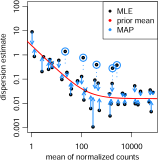

  
```{r echo = FALSE, message = FALSE}
xaringanExtra::use_share_again()
xaringanExtra::style_share_again(
  share_buttons = c("twitter", "linkedin", "pocket")
)

library(tidyverse)
library(here)

testable <- fontawesome::fa("fas fa-pencil-alt", fill = "FireBrick")

counts <- read_csv(here("data", "pasilla_gene_counts.csv")) %>% 
  column_to_rownames("gene_id") %>% 
  rowwise() %>% 
  mutate(mean     = mean(c_across(treated1:untreated4)),
         variance = var(c_across(treated1:untreated4)))

metadata <- read_csv(here("data", "pasilla_metadata.csv")) %>% 
  column_to_rownames("file")
```

## Learning outcomes

- Describe properties of read count data and how DESeq models them.

- Use R markdown to create reproducible documents.

---

class: center middle

## Goal: Determine significant changes in gene expression between conditions

---

## Challenges to identify differentially expressed genes `r testable`

- Distinguish technical variation from variation due to treatment.

- Majority of genes do not change between treatments.

- Only a few replicates per treatment, difficult to estimate variance.

---

## Challenges to identify differentially expressed genes `r testable`

- Distinguish technical variation from variation due to treatment.

- Majority of genes do not change between treatments.

- **Only a few replicates per treatment, difficult to estimate variance.**

---

## Goal: Model count matrix

Read count matrix $K_{ij}$ for each gene (row) $i$ and sample (column) $j$

```{r echo = FALSE}
knitr::kable(head(counts[, 1:6]), format = "html")
```

???

- Data: Pasilla data set
- We aim to model the raw counts $K_{ij}$ to infer the actual quantity of RNA in the cells.

---

## Read count distribution `r testable`

```{r echo = FALSE, fig.width = 12}
ggplot(counts) +
  geom_histogram(aes(x = untreated1), stat = "bin", bins = 200) +
  xlab("Raw expression counts") +
  ylab("Number of genes")
```

???

- Data: Pasilla data set
- Read counts do not follow normal distribution.
- One approach: log-transformation. (Not testable)

---

## Properties of read counts `r testable`

- Sparse event, i.e. small likelihood $p$ of a read mapping to a specific gene.

- Discrete and high number of events $n$, i.e. sampling depth (number of reads).

--

- One way of modelling raw counts is the Poisson distribution.

--

    An important property of this distribution is that mean = variance

???

- Only holds true if samples are technical replicates.

- Formula for Poisson distribution (not testable):

    $$P\left( x \right) = \frac{{e^{ - \lambda } \lambda ^x }}{{x!}}$$
    Calculates $P\left( x \right)$ the **probability** of observing $x$ **number of events** with $\lambda$ **average number of events per interval**.
    
    One property of this distribution is that mean = variance = lambda

---

## In reality, RNAseq data is over-dispersed: <br /> mean < variance

```{r echo = FALSE, warning = FALSE, fig.width = 12}
counts %>% 
  ggplot() +
  geom_point(aes(x = mean, y = variance)) + 
  scale_y_log10(limits = c(1,1e9)) +
  scale_x_log10(limits = c(1,1e9)) +
  geom_abline(intercept = 0, slope = 1, color = "red")
```

???

- Higher variability in low-expression genes.
- Heteroscedasticity: difference in variability across means

---

## Dealing with variance `r testable`

- Only few replicates/conditions make it difficult to estimate variance.

- At low expression very noisy.

--

### {DESeq2} solution

- Model count matrix with negative binomial distribution.

- Borrow information across genes to estimate dispersion and ultimately variance.

- Determine the log2 fold change and its significance (Wald statistic).

---

## Goal: Model count matrix

Read count matrix $K_{ij}$ for each gene (row) $i$ and sample (column) $j$

```{r echo = FALSE}
knitr::kable(head(counts[, 1:6]), format = "html")
```

---

## Negative bionomial distribution

Distribution with over-dispersion

$$K_{ij} \sim \operatorname{NB}\left(\mu_{ij}, \alpha_i \right)$$
    
with $K$ raw count of gene $i$ in sample $j$ with fitted mean $\mu_{ij}$ and gene-specific dispersion $\alpha_i$.

--

with mean
    
$$\mu_{ij} = s_{j}q_{ij}$$
    
sample-specific size factor $s_j$, true expression level $q_{ij}$

--

and variance
    
$$\operatorname{Var}\left(K_{ij} \right) = \mu_{ij} + \alpha_i\mu^2_{ij}$$
--

By estimating gene-wise dispersion $\alpha_i$ we can determine the variance.

???

The tilde symbol $\sim$ means "model."

Size factor $s_j$ was determined for count normalization.

Form for negative binomial distribution (not testable)

$$k \mapsto \binom{k+ r - 1 }{k} \cdot (1-p)^rp^k$$

with $k$ number of success(es) before $r$ failure(s) with $p$ probability of success

with mean $\frac{{p r}}{{1 - p}}$ and variance $\frac{{p r}}{{\left(1 - p  \right)^2}}$.

$\log_2$ fold changes

$$\log_2\left(q_{ij}\right) = x_j\beta_i$$

with coefficients $\beta_i$ giving the $\log_2$ fold changes for gene $i$ for each column of the model matrix $X$.

---

## Estimating gene-wise dispersion

```{r echo = FALSE, out.width = "60%", fig.align = "center"}

```

Love et al., 2014, Genome Biol 15:550.

???
