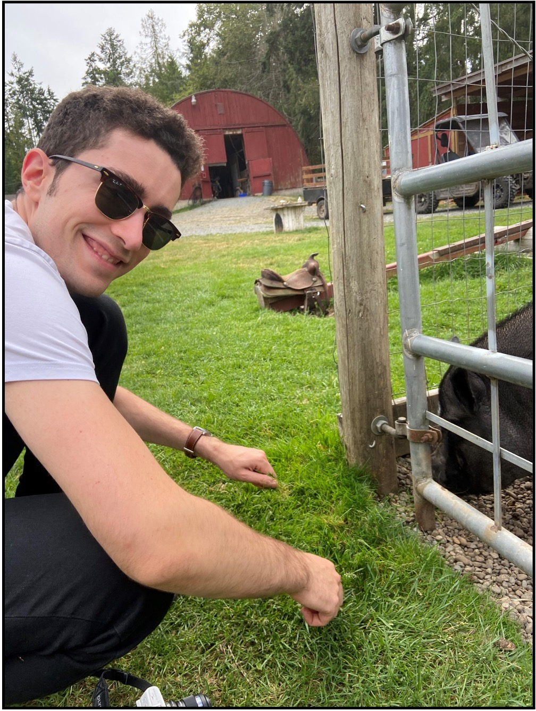
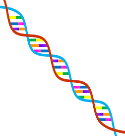
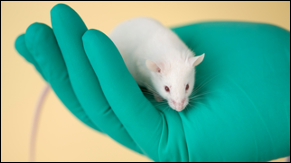

```{r setup, echo=FALSE}
xaringanExtra::use_share_again()
xaringanExtra::style_share_again(
  share_buttons = c("twitter", "linkedin", "pocket")
)
```

## About me

```{r echo = FALSE, fig.show = "hold", out.width = "20%", fig.align = "default"}

knitr::include_graphics("../../images/seattle.jpg")



```

???

A bit about my background:

I grew up in Seattle, Washington, and went to school at UC Berkeley where I studied Neurobiology and French Literature.

I did my undergraduate research work on mouse models of Alzheimer’s disease at the Gladstone Institute for Neurological Disease at UCSF

I graduated from Cal in 2018 and worked for a year at a biotech company in Bothell, Washington.

I started my graduate studies at UBC last September. I’m currently working on a bioinformatics project at the Hirst Lab related to reference genome customization to improve the quality of epigenomic data.

I like to cycle and ski in my free time

This is my first experience TAing so any feedback would be welcome!

---

## Course Expectations for Tutorials

Tutorials are delivered every Friday at 10am or 2pm

- Review & reinforce concepts introduced in the lecture
- Material may be examinable

Groups

- Breakout groups
- Project groups
    
Review the syllabus!

---

## Virtual office hours start next week

- **11am – 12pm Tuesdays<sup>*</sup>**  
  Accessible on Zoom tab in Canvas

- Email: ahauduc@bcgsc.ca

  - Please start subject line with "MICB405: "
  - Please ask your classmates/teammates & check online resources first
  - I will do my best to get back to you within 48 hours

.footnote[[*] may be subject to change]

???

Please work with your group members 

---

## Online resources for help

```{r echo = FALSE, fig.show = "hold", out.width = "50%", fig.align = "default"}


knitr::include_graphics("../../images/stack_overflow_logo.svg")
knitr::include_graphics("../../images/google_logo.svg")
```

---

## General tutorial logistics

Presentation → demonstrations → worksheet

Worksheets will be posted to the course website:  
https://educe-ubc.github.io/MICB405/index.html

Tutorials Website link at the bottom of Canvas home page & in Modules

---

## Today’s tutorial

I will pass out your server credentials on slips of paper – please keep these safe

Check the Setup page for your operating system, then go through the worksheet

If you connected to the server and completed the worksheet, you may leave the tutorial

Please let me know if you want to change tutorial sections

---

class: center middle

## Questions?
